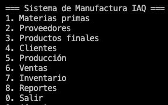
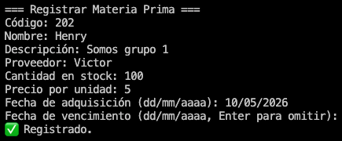

# 📌 Sistema de Gestión de Manufactura — IAQ

> Sistema de gestión integral para empresas de manufactura, desarrollado en Python utilizando el marco de trabajo SCRUM.

---

## 📖 Descripción

Este sistema permite administrar de forma centralizada los procesos clave de una empresa de manufactura: materias primas, proveedores, productos finales, clientes, órdenes de producción, ventas, inventario y reportes.  
Su objetivo es optimizar el flujo operativo, garantizar trazabilidad y mantener un control preciso del inventario.

---

## 📑 Tabla de contenidos

* [Descripción](#-descripción)
* [Tecnologías utilizadas](#-tecnologías-utilizadas)
* [Requisitos previos](#-requisitos-previos)
* [Instalación](#-instalación)
* [Uso](#-uso)
* [Estructura del proyecto](#-estructura-del-proyecto)
* [Funcionalidades](#-funcionalidades)
* [Capturas de pantalla](#-capturas-de-pantalla)
* [Compatibilidad](#-compatibilidad)
* [Roadmap](#-roadmap--mejoras-futuras)
* [Contribuciones](#-contribuciones)
* [Licencia](#-licencia)
* [Autor](#-autor)

---

## 🛠️ Tecnologías utilizadas

* Python 3
* Manejo de archivos JSON
* Programación modular
* SCRUM como metodología de desarrollo

---

## ⚙️ Requisitos previos

Antes de ejecutar el proyecto, asegúrate de tener instalado:

* Python 3.10 o superior
* Pip (si se requieren dependencias adicionales)
* Editor de código (VS Code recomendado)

---

## 🚀 Instalación

```bash
# Clonar el repositorio
git clone URL_DEL_REPOSITORIO

# Entrar al directorio
cd Sistema-Manufactura-IAQ

# Ejecutar el sistema
python main.py
```

---

## ▶️ Uso

```bash
python main.py
```

---

## 📁 Estructura del proyecto

```plaintext
Sistema-Manufactura-IAQ/
│── main.py
│── clientes.py
│── inventario.py
│── materias_primas.py
│── persistence.py
│── produccion.py
│── productos.py
│── proveedores.py
│── reportes.py
│── validators.py
│── ventas.py
│── README.md
│
├── data/
│   ├── clientes.json
│   ├── inventario.json
│   ├── materias_primas.json
│   ├── produccion.json
│   ├── productos.json
│   ├── proveedores.json
│   ├── ventas.json
│
├── img/
│   ├── image.png
│   ├── funciones.png
```

---

## ⚙️ Funcionalidades

### ✔️ Materias Primas

- Registrar, listar, editar y eliminar materias primas
- Campos: código, nombre, descripción, proveedor, stock, precio/unidad, fechas
- Actualización automática del inventario

### ✔️ Proveedores

- CRUD completo
- Campos: empresa, contacto, dirección, teléfonos, correo, historial

### ✔️ Productos Finales

- CRUD completo
- Actualización automática del inventario

### ✔️ Clientes

- CRUD completo
- Historial actualizado con cada orden de venta

### ✔️ Producción

- Crear y listar órdenes
- Flujo: Pendiente → En Proceso → Completada / Cancelada
- Descuento automático de materias primas
- Validación de stock

### ✔️ Ventas

- Crear y listar órdenes
- Flujo: Pendiente → En Proceso → Enviado → Entregado / Cancelado
- Descuento automático de productos
- Validación de stock

### ✔️ Inventario

- Vista general de materias primas y productos
- Actualización automática

### ✔️ Reportes

- Materias primas en stock
- Proveedores con historial
- Órdenes de producción
- Productos finales
- Clientes con historial
- Órdenes de venta
- Inventario general

---

## 🖼️ Capturas de pantalla

### Programa funcionando correctamente



### Funciones del programa



---

## 💻 Compatibilidad

- Windows
- macOS
- Linux

---

## 🚧 Roadmap / Mejoras futuras

- Interfaz gráfica
- Base de datos SQL
- Sistema de usuarios y permisos
- Exportación de reportes PDF y Excel
- Dashboard estadístico

---

## 🤝 Contribuciones

Las contribuciones son bienvenidas.  
Puedes realizar un fork del proyecto y enviar tus mejoras mediante pull requests.

---

## 📄 Licencia

Proyecto desarrollado con fines educativos.

---

## 👥 Integrantes del equipo

| Rol SCRUM | Nombre |
|---|---|
| Product Owner | Henry Morales |
| Scrum Master | Lesli Zuniga |
| Developer | Victor Recinos |
| Developer | Henry Morales |
| Developer | Lesli Zuniga |

---

## 📄 Documentacion
https://docs.google.com/document/d/1B5iOiU0q3wJl9o4PoHQfeuDA_chhGQkRXI2o97HfqR4/edit?usp=sharing
